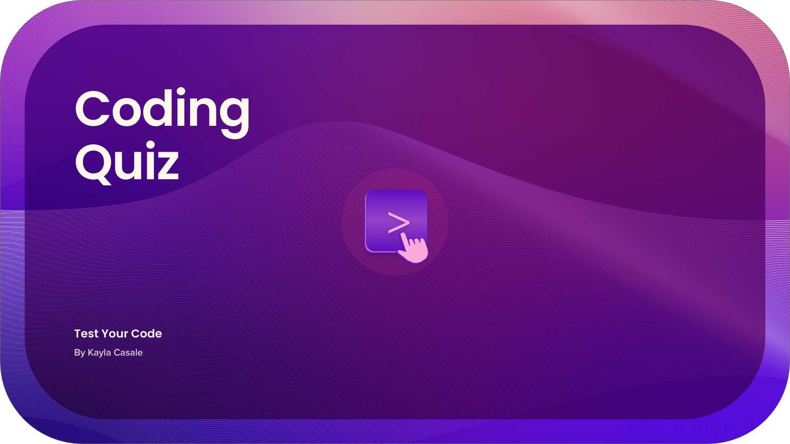
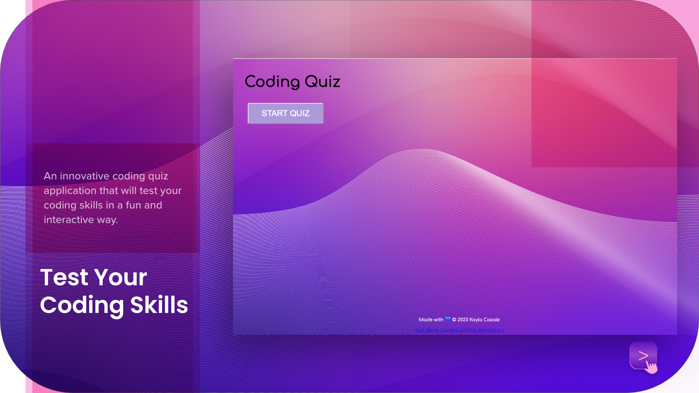
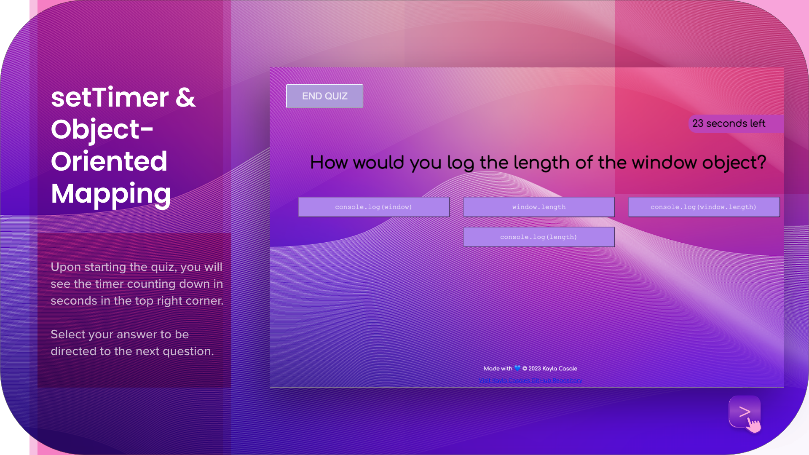
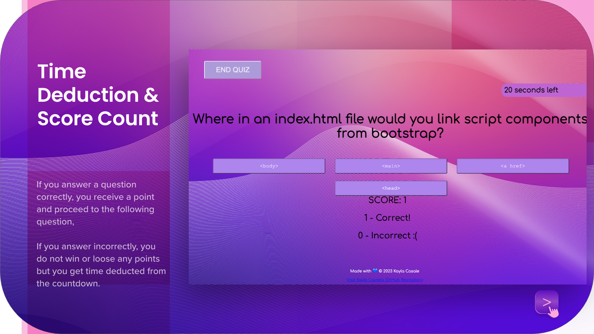
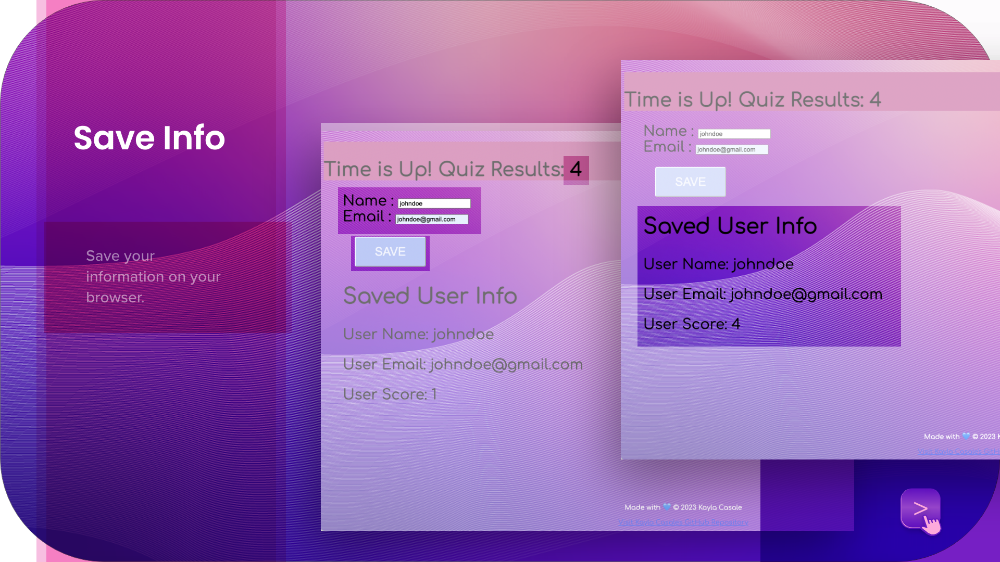

# A Quiz for Coders

## code-quiz
A coding assessment with timed multiple-choice questions. 

## Table of Contents
* [About](#about)
* [Installation](#installation)
* [Deck](#deck)
* [User Story](#user-story)
* [Acceptance Criteria](#acceptance-criteria)
* [Frameworks & Libraries](#frameworks--libraries)
* [Languages](#languages)
* [Mockup](#mockup)
* [Focus Points](#focus-points)

## About
Introducing our innovative coding quiz application that will test your coding skills in a fun and interactive way! With a user-friendly interface, this application will allow you to choose from a variety of programming languages and skill levels.

But here's the twist - you'll have to think quickly and accurately as this quiz dynamically deducts time for every incorrect answer! So make sure you're on your game and stay focused to achieve the highest score possible. And don't worry about losing your progress - our Web-APIs will save your input locally so you can pick up right where you left off.

So what are you waiting for? Test your coding skills and challenge yourself with our unique multiple choice coding quiz application!

## Installation
**Link to My Code Quiz:** https://kaylacasale.github.io/code-quiz/ 

**Link to my GitHub repository**: https://github.com/kaylacasale/code-quiz 

## Deck
1. 
2. 
3. 
4. 
5. 

## User Story
AS A developer enrolled in a coding boot camp

I WANT to create a timed quiz on Javascript fundamentals that stores high scores

SO THAT students can gauge their progress compared to their peers

## Acceptance Criteria
GIVEN I am taking the code quiz on my browser

WHEN I click the start button

THEN a timer starts and I am presented with a question

WHEN I answer a question 

THEN I am presented with the following question

WHEN I answer a question incorrectly

THEN I do not gain a point towards my overall score

WHEN all questions are answered and I click the end button or when the timer reaches 0

THEN the game is over

WHEN the game is over

THEN I can save my name, email, and score

## Frameworks & Libraries
> Bootstrap

> jQuery UI

## Languages 
- HTML

- CSS

- Javascript

## Mock-up
The following shows the web application's appearance and functionality.

https://user-images.githubusercontent.com/115776118/207259014-76ae0688-b230-4710-8c3e-3e4609d08ede.mov

### Focus Points
Web APIs | Local Storage | Javascript | Automation with For Loops | Dynamic Elements | Set Timer | **Object-Oriented Mapping**